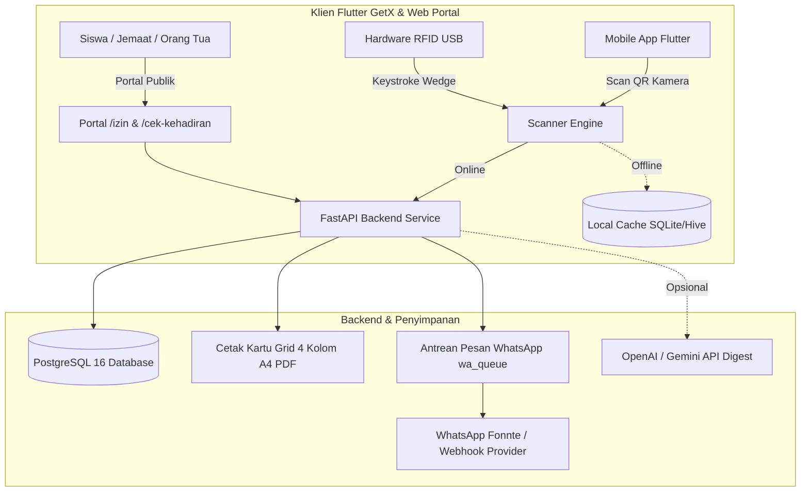

# 🌟 Open Presensi

> **Sistem Presensi, Identitas Digital & Manajemen Komunitas Open Source untuk Sekolah & Gereja Kecil di Indonesia.**  
> *Offline-First Flutter Client, Scanner Kamera QR & Hardware RFID, WhatsApp Gateway Anti-Ban, Cetak Kartu A4 Grid 4 Kolom, Portal Izin Mandiri, dan Sirkulasi Aset.*

[](https://opensource.org/licenses/MIT)
[](https://fastapi.tiangolo.com)
[](https://flutter.dev)
[](https://www.docker.com)
[](CONTRIBUTING.md)

---

## 🇮🇩 Bahasa Indonesia

**Open Presensi** adalah sintesis dan generalisasi open source komprehensif dari portofolio sistem nyata yang telah dibangun dan beroperasi di berbagai instansi di Indonesia:
1. **Absensi Sekolah QR Code & Absensi Kantor QR (CodeIgniter 4)**: Dukungan ganda QR + Hardware RFID scanner, Cetak Kartu ID Grid 4 Kolom A4, Portal Pengajuan Izin/Sakit Mandiri (`/izin`), Portal Cek Kehadiran Mandiri (`/cek-kehadiran`), Perhitungan Menit Keterlambatan, Peringatan 3 Hari Bolos Berurutan, dan Impor Massal CSV.
2. **GMIT Pniel (Sistem Informasi Gereja)**: Hierarki demografi bertingkat (*Wilayah $\rightarrow$ Rayon $\rightarrow$ Keluarga $\rightarrow$ Jemaat*), Kategorial, dan antrean WhatsApp background worker (`wa_queue`) dengan simulasi pengetikan dan jeda acak manusia anti-banned.
3. **Absensi Familia (Kupang, NTT)**: Klien Flutter GetX dengan proteksi kecurangan (*device hardware binding*, geofencing formula *Haversine*, dan siklus presensi datang/pulang).
4. **BukuHub & Inventaris**: Sirkulasi peminjaman buku/aset/sarana ibadah dengan pemindaian QR Code ganda.
5. **Penilaian Kebersihan**: Indikator status visual dinamis *Mode Online (DB Aktif)* vs *Mode Lokal (Offline)*.
6. **SMANFA**: Manajemen jadwal kegiatan, kalender operasional terpadu, dan integrasi kecerdasan buatan.

Sistem ini didesain agar dapat dijalankan langsung di server lokal murah, komputer sekolah/gereja, ataupun cloud hanya dengan perintah `docker compose up -d`.

---

## 🇬🇧 English

**Open Presensi** is an offline-first, domain-agnostic attendance, digital badge, and grassroots resource platform. It unifies verified design patterns from production systems across Indonesia into a modern, containerized architecture.

### Key Highlights
* 📱 **Flutter Client (GetX)**: Dual input support (Camera QR scanner stream + USB RFID keyboard wedge reader), offline local queue with one-tap cloud synchronization.
* ⚡ **FastAPI + PostgreSQL Backend**: High-performance async REST API with interactive OpenAPI docs, JWT auth, and device binding anti-cheat.
* 🖨️ **Printable 4-Column A4 ID Card Generator**: Ready-to-cut printable sheets with institution headers, barcodes, and borders.
* 🌐 **Public Self-Service Portals**: Free access endpoints for student/member leave submissions (`/izin`) with attachments, and public attendance verification (`/cek-kehadiran`).
* 💬 **Anti-Ban WhatsApp Worker**: Background message queue with human-like random delays (2–5s) and typing simulation.
* 📚 **Asset Circulation (BukuHub)**: Instant borrowing and return tracking for library books and church/school equipment via QR Code.
* 🤖 **AI Attendance Digest (Optional)**: Natural language summaries and action recommendations for principals and pastors via OpenAI/Gemini.

---

## 🏗️ Arsitektur Sistem (Architecture)



---

## 🧩 Pemetaan Entitas Generik (Domain-Agnostic Matrix)

| Entitas Generik | Implementasi Sekolah | Implementasi Gereja |
| :--- | :--- | :--- |
| **Organization** | SMA Swasta Nusantara | GMIT Jemaat Kasih Karunia |
| **Group / Division** | Kelas (e.g. X MIPA 1) | Rayon / Wilayah / Kategorial |
| **Member** | Siswa / Murid | Anggota Jemaat / Warga |
| **Staff / Pengurus** | Guru, Wali Kelas, Kepala Sekolah | Pendeta, Majelis, Panitia |
| **Event / Session** | KBM Harian, Upacara, Ekstrakurikuler | Ibadah Minggu, Pemuda, Doa Rayon |
| **Metode Presensi** | Kartu QR / RFID Siswa / Geofence Guru | Kartu QR / RFID Jemaat di Pintu Masuk |
| **Peminjaman Aset** | Buku Perpustakaan, LCD Proyektor | Perlengkapan Musik, Sarana Ibadah |

---

## 🚀 Panduan Memulai Cepat (Quick Start)

### 1. Klon Repositori & Masuk ke Direktori
```bash
git clone https://github.com/open-presensi/open-presensi.git
cd open-presensi
```

### 2. Jalankan Kontainer Docker
```bash
cp backend/.env.example backend/.env
docker compose up -d
```
Setelah kontainer aktif:
* **Interactive API Documentation (Swagger)**: [http://localhost:8000/docs](http://localhost:8000/docs)
* **Database Manager (Adminer)**: [http://localhost:8080](http://localhost:8080)

### 3. Isi Data Awal Dummy (Data Sanitization Preset)
```bash
# Preset Sekolah:
docker compose exec backend python -m database.seeder --preset sekolah

# Preset Gereja:
docker compose exec backend python -m database.seeder --preset gereja
```
### 4. Menjalankan Klien Mobile Flutter
```bash
cd client-flutter
flutter pub get

# Jika menggunakan HP Android fisik via kabel USB (port reverse):
adb reverse tcp:8000 tcp:8000

# Jalankan aplikasi ke perangkat:
flutter run
```
> **Catatan Pengujian Akun Bawaan (Seeder):**
> * **Admin / Kepala Sekolah**: `admin@komunitas.id` / `rahasia123` (Menu: Verifikasi Izin, Early Warning 3+ Hari Bolos, Pengaturan Organisasi & Geofence GPS, Ekspor Laporan).
> * **Guru / Staf Pengajar**: `guru@komunitas.id` / `rahasia123` (Menu: Pemindaian Presensi Siswa Kamera/RFID, Kartu QR Guru, Sirkulasi Aset LCD/Buku, Rekap Kehadiran, Pengajuan Izin Dinas).
> * **Siswa / Anggota**: Registrasi langsung di aplikasi via menu *"Daftar Akun Baru"* (Menu: Kartu QR Pelajar Digital, Pengajuan Izin Sakit, Cek Riwayat Kehadiran Pribadi).

---

## 📚 Panduan Lanjutan (Advanced Guides)
* 🛠️ **[Panduan Pemecahan Masalah & Debugging (TROUBLESHOOTING.md)](TROUBLESHOOTING.md)**: Solusi lengkap untuk error Python 3.13 bcrypt, koneksi HP Android fisik, port forwarding `adb reverse`, format tanggal lokal, dan izin kamera.
* 🎯 **[Panduan Kustomisasi: Mode Sekolah vs Mode Gereja (DOMAIN_CUSTOMIZATION.md)](DOMAIN_CUSTOMIZATION.md)**: Panduan langkah demi langkah memodifikasi aplikasi jika hanya ingin dipakai 100% untuk Sekolah saja ATAU 100% untuk Gereja saja tanpa meninggalkan jejak yang tidak terpakai.

---

## ❓ Tanya Jawab Umum (Frequently Asked Questions - FAQ)

<details>
<summary><b>1. Bagaimana cara kerja presensi offline jika sekolah/gereja tidak memiliki akses internet?</b></summary>
<p>Klien Flutter Open Presensi dirancang dengan prinsip <i>Offline-First</i>. Saat kamera memindai kartu QR siswa atau jemaat, data presensi langsung disimpan secara lokal di memori perangkat HP/tablet petugas dengan indikator warna kuning <b>Mode Lokal</b>. Ketika internet kembali tersedia, cukup tekan tombol <b>"Sinkron"</b> untuk mengunggah seluruh antrean secara massal ke server database PostgreSQL.</p>
</details>

<details>
<summary><b>2. Apakah scanner hardware RFID USB bisa langsung digunakan?</b></summary>
<p>Ya. Scanner RFID USB bekerja sebagai <i>Keyboard Wedge Input Device</i>. Saat kartu RFID ditempelkan ke reader, scanner akan mengetikkan nomor UID kartu dan mengirimkan sinyal tombol <i>Enter</i>. Di aplikasi Flutter, input teks RFID otomatis menangkap sinyal ini dan langsung memproses presensi secara instan tanpa perlu menyentuh layar.</p>
</details>

<details>
<summary><b>3. Bagaimana jika HP siswa rusak atau ganti ke HP baru (Device Binding)?</b></summary>
<p>Untuk mencegah kecurangan (titip absen), akun siswa dikunci ke ID perangkat saat login pertama kali. Jika siswa berganti ponsel, Administrator atau Wali Kelas dapat membuka menu <b>Panel Pengaturan & Anggota</b> di aplikasi, mencari nama siswa yang bersangkutan, lalu menekan tombol <b>"Reset Kunci Perangkat"</b>.</p>
</details>

<details>
<summary><b>4. Apakah WhatsApp Gateway wajib diaktifkan?</b></summary>
<p>Tidak wajib. WhatsApp Gateway bersifat opsional. Jika diaktifkan (melalui penyedia Fonnte atau generic webhook pada <code>backend/.env</code>), sistem akan otomatis mengirimkan notifikasi kehadiran ke orang tua siswa saat jam masuk/pulang. Antrean pesan diproses di latar belakang dengan jeda acak (2–5 detik) dan simulasi pengetikan manusia agar nomor WhatsApp Anda aman dari pemblokiran (anti-banned).</p>
</details>

<details>
<summary><b>5. Apakah saya bisa menggunakan aplikasi ini hanya untuk sekolah atau hanya untuk gereja?</b></summary>
<p>Bisa sekali. Sistem ini dibuat dengan arsitektur generik (domain-agnostic). Silakan baca panduan lengkap di <a href="DOMAIN_CUSTOMIZATION.md"><b>DOMAIN_CUSTOMIZATION.md</b></a> untuk melihat daftar file dan kata kunci apa saja yang perlu diubah agar aplikasi 100% bersih untuk kebutuhan spesifik Anda.</p>
</details>

---

## 📄 Lisensi (License)
Didistribusikan di bawah lisensi **MIT**. Silakan lihat file [LICENSE](LICENSE) untuk detail lengkap.


